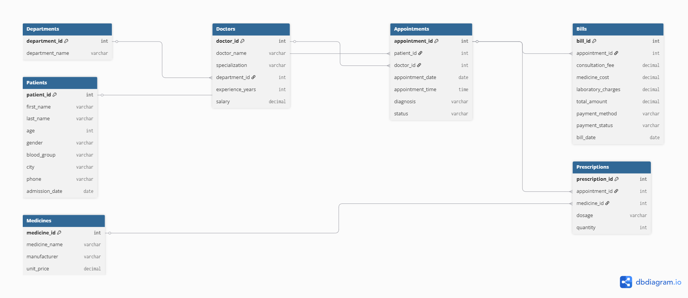

# 🏥 Hospital Management Database

A PostgreSQL-based Hospital Management Database demonstrating relational database design, SQL queries, healthcare analytics, and business reporting.

---

# 📖 Project Overview

The **Hospital Management Database** is a relational database project built using **PostgreSQL**. It simulates the operations of a hospital by managing patient records, doctor information, appointments, prescriptions, medicines, and billing.

This project demonstrates database design principles, SQL querying techniques, and healthcare data analysis. It is designed as a portfolio project to showcase SQL skills, database normalization, and business reporting capabilities.

---

# 🎯 Objectives

- Design a normalized relational database.
- Implement Primary Keys and Foreign Keys.
- Populate the database with realistic healthcare data.
- Perform CRUD operations using SQL.
- Demonstrate SQL querying techniques from beginner to intermediate level.
- Analyze healthcare data using business-oriented SQL queries.

---

# 🛠️ Technologies Used

- PostgreSQL
- pgAdmin 4
- SQL
- DBDiagram.io
- GitHub

---

# 🗄️ Database Tables

The database consists of the following tables:

| Table | Description |
|--------|-------------|
| Departments | Stores hospital departments |
| Doctors | Stores doctor information |
| Patients | Stores patient details |
| Appointments | Stores patient appointments |
| Medicines | Stores medicine information |
| Prescriptions | Stores prescribed medicines |
| Bills | Stores patient billing details |

---

# 📊 Entity Relationship Diagram

The ER Diagram illustrates the relationships between all database tables.

---

# 📄 Database Schema

The complete database schema is available here:

➡️ **[Database Schema](Database_Schema.md)**

---

# 💻 SQL Concepts Covered

This project demonstrates the following SQL concepts:

- Database Design
- Relational Database Modeling
- Primary Keys
- Foreign Keys
- Constraints
- Data Insertion
- SELECT Statements
- WHERE Clause
- ORDER BY
- DISTINCT
- BETWEEN
- IN
- LIKE
- LIMIT
- INNER JOIN
- Aggregate Functions
- COUNT()
- SUM()
- GROUP BY
- ORDER BY

---

# 📈 Business Questions Solved

Some of the business problems addressed using SQL include:

- How many patients has each doctor treated?
- Which department generates the highest revenue?
- What are the billing details for each patient?
- Which medicines are prescribed to each patient?
- Which doctors belong to each department?
- How many appointments have been completed or cancelled?
- Which patients belong to a specific age group?
- What is the total revenue generated by the hospital?
- Which payment methods are most frequently used?
- Which medicines are the most expensive?

---

# 📷 Sample Outputs

The repository includes:

- ER Diagram
- Database Schema
- SQL Scripts

---

# 🚀 Future Improvements

Potential enhancements include:

- Add Nurse Management module.
- Add Hospital Room Allocation.
- Add Laboratory Test Management.
- Add Inventory Management.
- Create SQL Views for reporting.
- Implement Stored Procedures and Functions.
- Add Triggers for automatic billing updates.
- Develop a Power BI dashboard connected to the database.

---

# 👩‍💻 Author

**Harminder Kaur**

Aspiring Data Analyst | Biotechnology Graduate | Incoming Master's Student in Medical Biotechnology

---

## ⭐ If you found this project useful, consider giving it a Star!
